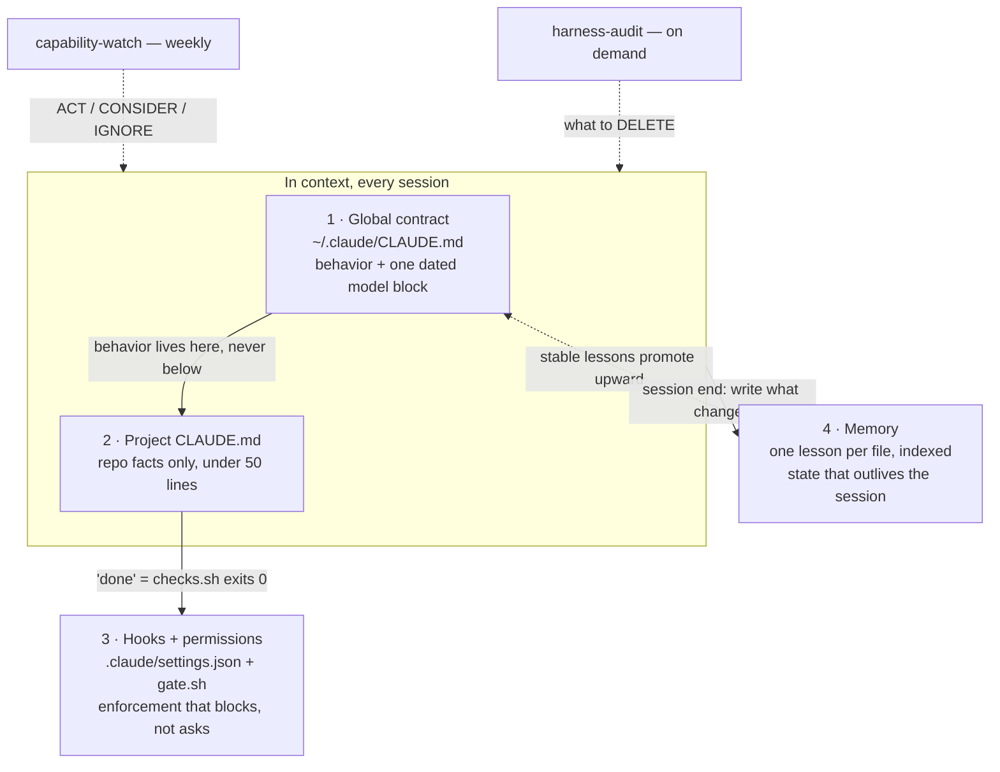
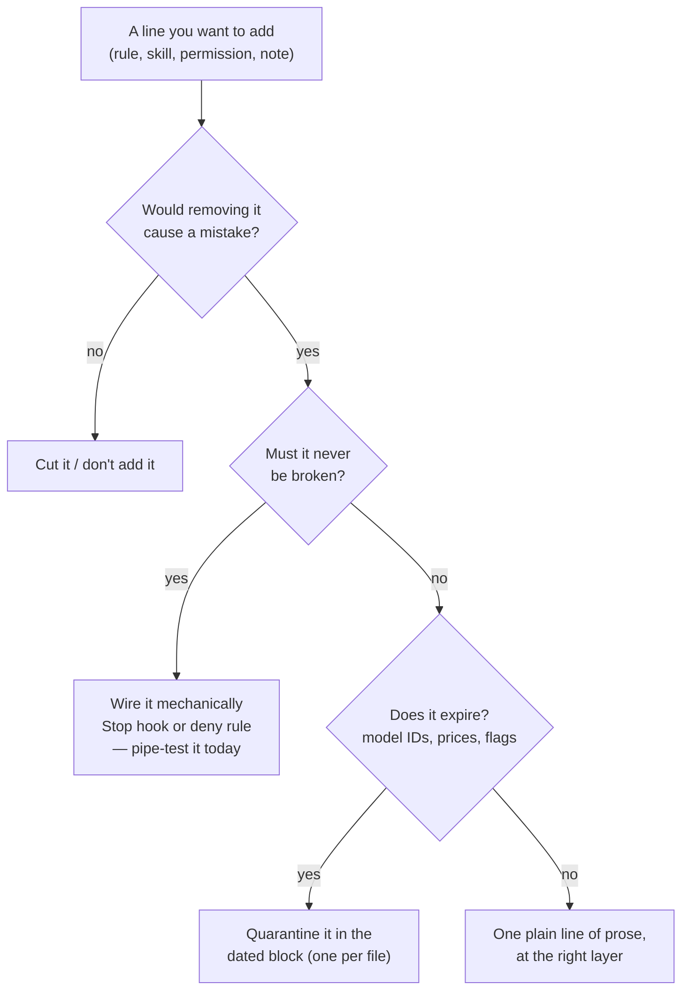

# Claude Hygiene Kit

[](https://github.com/chinhau/claude-hygiene-kit/actions/workflows/test.yml) [](https://github.com/chinhau/claude-hygiene-kit/actions/workflows/freshness.yml)

**The most popular Claude Code frameworks ship 135 agents and 400+ components. We ran this
kit's audit against one of them — a 23k-star framework — and found 31% of its shipped payload
(~3,200 lines, 22 components, including all "7 modes" its own description advertises) is
unreachable by any install path: [full audit, every finding quoted with file:line](audits/superclaude-2026-07.md).**
The rest is context tax — tokens paid on every turn, and per Anthropic's own guidance,
over-prescriptive scaffolding actively *degrades* current models' output.

This kit is the other direction: **9 files, one skill that tells you what to DELETE, and a
Stop hook that actually blocks bad closes.** Minimal CLAUDE.md, tested enforcement, and a
weekly routine that ends changelog FOMO.

If Claude ignores your CLAUDE.md, your hooks aren't firing, your pinned model got deprecated,
or your setup grew past what you can audit — that's what this fixes.



## Already have a Claude setup? Start with the audit.

Most setups need deletion before they need this kit's additions:

```bash
cp -r skills/harness-audit ~/.claude/skills/
# then, in any Claude Code session:
#   "audit my Claude setup"
```

It reports what to remove, ranked: **BROKEN-PROMISE** (enforcement you documented but never
wired) → **DEGRADES-OUTPUT** (ALWAYS/NEVER boilerplate written for older models) → **ROT**
(stale model IDs, frozen point-in-time state) → **CRUFT** (dead permissions). The headline
metric is the deletion tally.

## Fresh start — quickstart

Prerequisites: Claude Code, `bash`, `jq` (the gate refuses to run without it — loudly, not silently).

1. **Global contract** — `cp global/CLAUDE.md ~/.claude/CLAUDE.md` (merge, don't overwrite, if
   one exists). Fill **all seven** `{{placeholders}}`: three working-style lines and the dated
   models block. Current model names live in the [model config docs](https://code.claude.com/docs/en/model-config) —
   deliberately not hardcoded here.
2. **Automatic model fallback** — in `~/.claude/settings.json` (create it if absent):
   ```json
   { "model": "<your-pin>", "fallbackModel": ["<next-best>", "default"] }
   ```
3. **Per project** — note the trailing `/.` (a `*` glob silently drops the hidden `.claude/`,
   and with it the enforcement):
   ```bash
   cp -r project-template/. myproject/
   mv myproject/CLAUDE.md.template myproject/CLAUDE.md   # fill its placeholders
   # put your real verify command(s) in myproject/checks.sh, then prove the gate works:
   cd myproject && bash .claude/hooks/test-gate.sh        # expect: ALL PASS
   ```
   Silence from the gate means "checks green or nothing configured" — a `decision: block` JSON
   means the gate works and your checks currently fail. Both prove the wiring.
4. **Weekly capability watch** — run `/schedule` (or a local `/loop`) and paste the prompt from
   `routines/capability-watch.md`, cadence weekly. See that file's note on cloud vs local execution.

## What goes where

| Source | Destination | What it is |
|---|---|---|
| `global/CLAUDE.md` | `~/.claude/CLAUDE.md` | The one behavioral contract, every session |
| `project-template/.` | `<your-project>/` | Thin CLAUDE.md + tested Stop gate + checks.sh |
| `skills/harness-audit/` | `~/.claude/skills/` | The deletion auditor — the reason this kit exists |
| `routines/capability-watch.md` | your scheduler | Weekly ACT / CONSIDER / IGNORE changelog triage |
| `RECEIPTS.md` | (for humans) | Every rule with its evidence — not config |

## Why so small — the three principles



1. **Prose suggests; hooks enforce.** "NEVER" in caps is a wish. A Stop hook that runs your
   checks is a fact. Every line you delete is context tax you stop paying on every turn.
2. **Every line must earn its place.** The litmus above is the whole methodology.
3. **Quarantine what expires.** Model names and prices live in one dated block per file, so a
   model retirement or ban is a one-block edit — everything else survives unchanged.

Versus the mega-collections:

| | This kit | Typical framework |
|---|---|---|
| Files shipped | 10 | 100–400+ |
| Context loaded per session | ~60 lines | thousands |
| Enforcement mechanism | tested Stop hook + deny rules | "NEVER" prose |
| Pinned model retired | auto-fallback + one-block edit | grep and pray |
| Ever tells you to *remove* anything | yes — it's the flagship | no |

Evidence for every rule: [RECEIPTS.md](RECEIPTS.md). The creator of Claude Code
[runs a surprisingly vanilla setup](https://x.com/bcherny/status/2007179832300581177) —
that's the direction this kit bets on.
