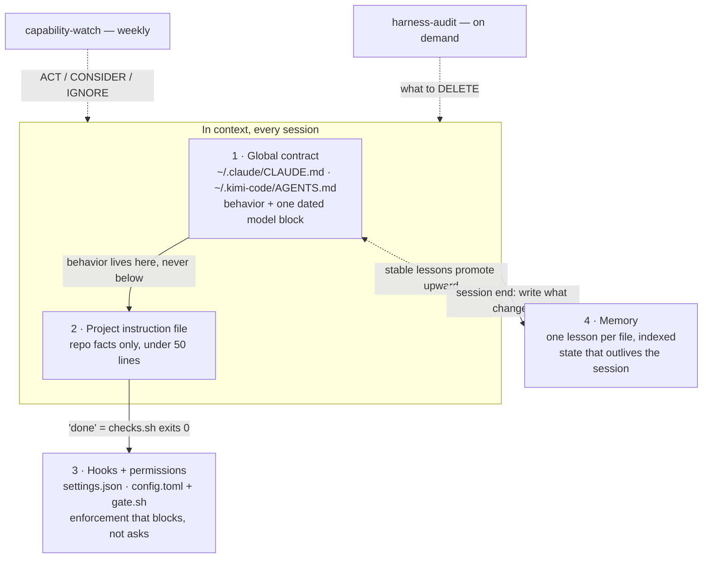
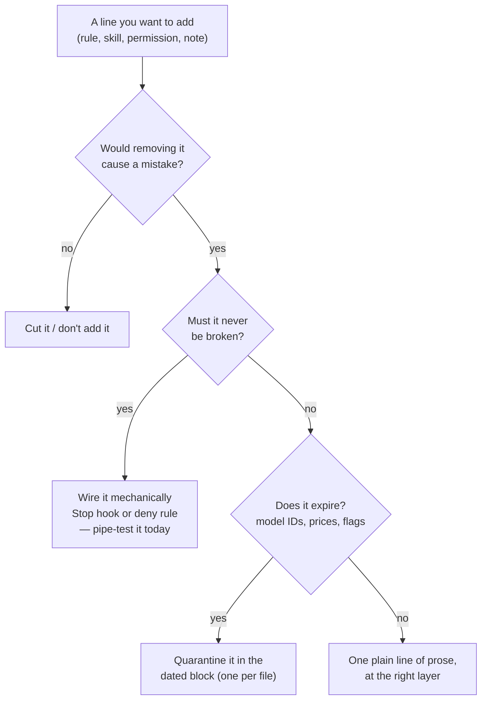

# Harness Hygiene Kit

[](https://github.com/chinhau/claude-hygiene-kit/actions/workflows/test.yml) [](https://github.com/chinhau/claude-hygiene-kit/actions/workflows/freshness.yml)

**The most popular agent frameworks ship 135 agents and 400+ components. We ran this
kit's audit against one of them — a 23k-star framework — and found 31% of its shipped payload
(~3,200 lines, 22 components, including all "7 modes" its own description advertises) is
unreachable by any install path: [full audit, every finding quoted with file:line](audits/superclaude-2026-07.md).**
The rest is context tax — tokens paid on every turn, and per the vendors' own guidance,
over-prescriptive scaffolding actively *degrades* current models' output.

This kit is the other direction: **a handful of files per harness, one skill that tells you
what to DELETE, and a Stop hook that actually blocks bad closes.** A minimal global contract,
tested enforcement, and a weekly routine that ends changelog FOMO — for **Claude Code** and
**Kimi Code**, from one source of truth.

If your agent ignores its instruction file, your hooks aren't firing, your pinned model got
deprecated, or your setup grew past what you can audit — that's what this fixes.


```mermaid
flowchart TD
    subgraph LOADED["In context, every session"]
        G["1 · Global contract<br/>~/.claude/CLAUDE.md · ~/.kimi-code/AGENTS.md<br/>behavior + one dated model block"]
        P["2 · Project instruction file<br/>repo facts only, under 50 lines"]
        G -->|"behavior lives here, never below"| P
    end
    E["3 · Hooks + permissions<br/>settings.json · config.toml + gate.sh<br/>enforcement that blocks, not asks"]
    M["4 · Memory<br/>one lesson per file, indexed<br/>state that outlives the session"]

    P -->|"'done' = checks.sh exits 0"| E
    LOADED -->|"session end: write what changed"| M
    M -.->|"stable lessons promote upward"| G

    W["capability-watch — weekly"] -.->|"ACT / CONSIDER / IGNORE"| LOADED
    A["harness-audit — on demand"] -.->|"what to DELETE"| LOADED
```

## Layout — one kit, two harnesses

| Directory | Harness | Contents |
|---|---|---|
| `shared/` | both | Contract core (single source) + the harness-audit skill |
| `claude/` | Claude Code | Dated models block, project template, routine — **[install](claude/README.md)** |
| `kimi/` | Kimi Code | Dated models block, Stop gate, skills, launchd watch — **[install](kimi/README.md)** |
| `audits/` | — | Worked audit examples, every finding quoted with file:line |
| `scripts/sync-contract.sh` | both | Regenerates each harness's contract template from `shared/` + its models block; CI fails on drift |

The contract's working-style, behavior, and memory rules are harness-agnostic and live exactly
once, in `shared/contract-core.md`. What legitimately differs per harness — the dated models
block — lives in `<harness>/models-block.md`.

## Already have a setup? Start with the audit.

Most setups need deletion before they need this kit's additions:

```bash
cp -r shared/skills/harness-audit ~/.claude/skills/      # or ~/.kimi-code/skills/
# then, in any session:
#   "audit my setup"
```

It reports what to remove, ranked: **BROKEN-PROMISE** (enforcement you documented but never
wired) → **DEGRADES-OUTPUT** (ALWAYS/NEVER boilerplate written for older models) → **ROT**
(stale model IDs, frozen point-in-time state) → **CRUFT** (dead permissions). The headline
metric is the deletion tally. Running both harnesses? It audits the two against each other —
cross-harness drift is a finding class neither tool can see alone.

## Why so small — the three principles


```mermaid
flowchart TD
    S["A line you want to add<br/>(rule, skill, permission, note)"] --> Q1{"Would removing it<br/>cause a mistake?"}
    Q1 -- no --> CUT["Cut it / don't add it"]
    Q1 -- yes --> Q2{"Must it never<br/>be broken?"}
    Q2 -- yes --> HOOK["Wire it mechanically<br/>Stop hook or deny rule<br/>— pipe-test it today"]
    Q2 -- no --> Q3{"Does it expire?<br/>model IDs, prices, flags"}
    Q3 -- yes --> DATE["Quarantine it in the<br/>dated block (one per file)"]
    Q3 -- no --> PROSE["One plain line of prose,<br/>at the right layer"]
```

1. **Prose suggests; hooks enforce.** "NEVER" in caps is a wish. A Stop hook that runs your
   checks is a fact. Every line you delete is context tax you stop paying on every turn.
2. **Every line must earn its place.** The litmus above is the whole methodology.
3. **Quarantine what expires.** Model names and prices live in one dated block per file, so a
   model retirement or ban is a one-block edit — everything else survives unchanged.

Versus the mega-collections:

| | This kit | Typical framework |
|---|---|---|
| Files shipped | ~10 per harness | 100–400+ |
| Context loaded per session | ~60 lines | thousands |
| Enforcement mechanism | tested Stop hook + deny rules | "NEVER" prose |
| Pinned model retired | auto-fallback + one-block edit | grep and pray |
| Ever tells you to *remove* anything | yes — it's the flagship | no |

Evidence for every rule: [RECEIPTS.md](RECEIPTS.md). The creator of Claude Code
[runs a surprisingly vanilla setup](https://x.com/bcherny/status/2007179832300581177) —
that's the direction this kit bets on.
